# v.f.labs

Turborepo monorepo — three Next.js 15 sites + shared packages.

## Sites

### [Vague Frequency Laboratory ↗](https://vague-frequency-labs.vercel.app/?utm_source=github&utm_content=repo_readme) · `:3004`

[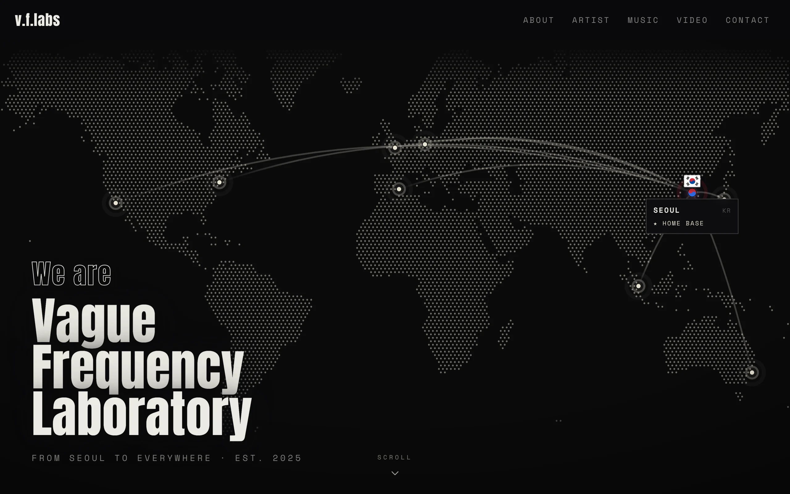](https://vague-frequency-labs.vercel.app/?utm_source=github&utm_content=repo_readme)

<details>
<summary><strong>Sections</strong> — About · Artist Profiles · Music</summary>

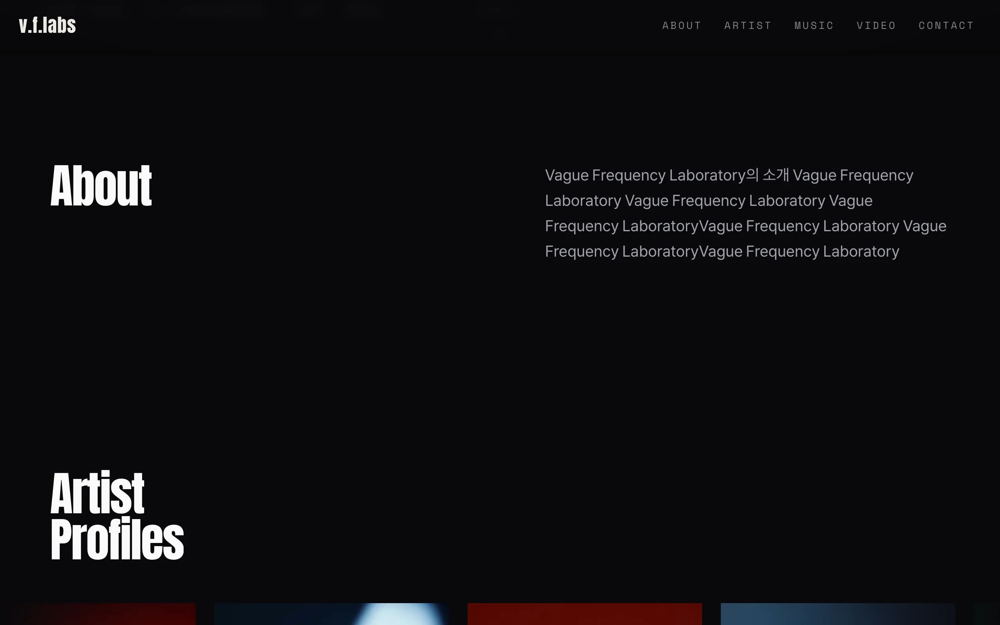
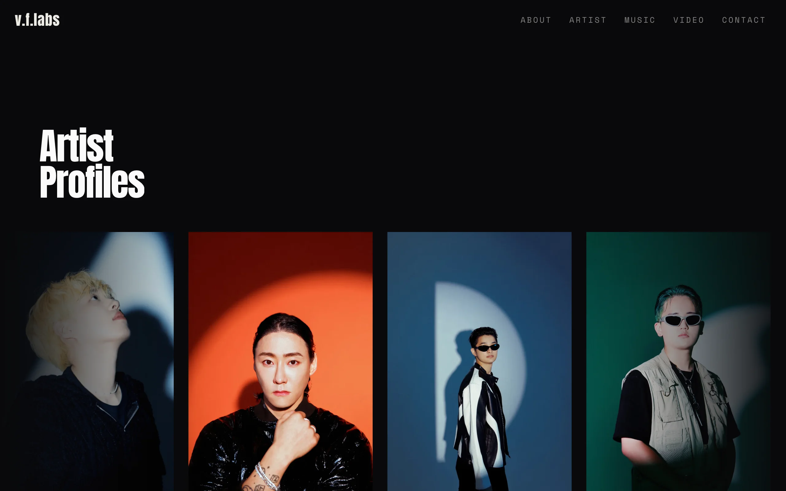
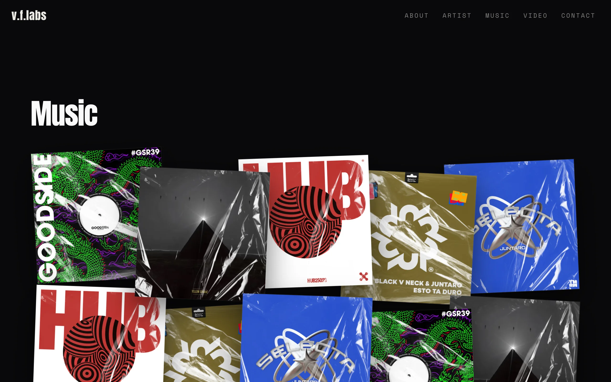

</details>

### [Payday Records ↗](https://payday-records.vercel.app/?utm_source=github&utm_content=repo_readme) · `:3002`

[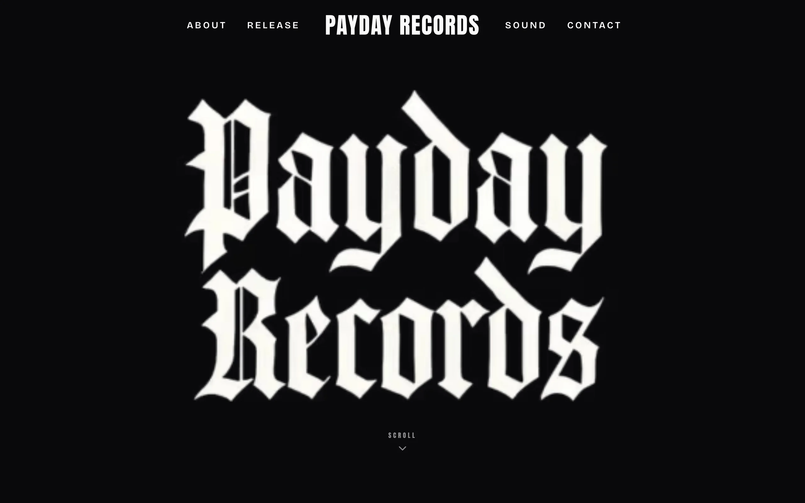](https://payday-records.vercel.app/?utm_source=github&utm_content=repo_readme)

<details>
<summary><strong>Sections</strong> — About · Release · Sound · Contact</summary>

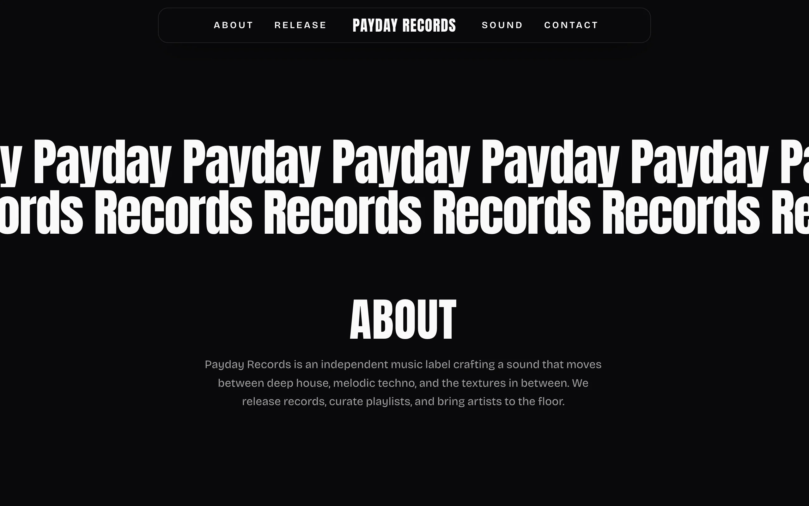
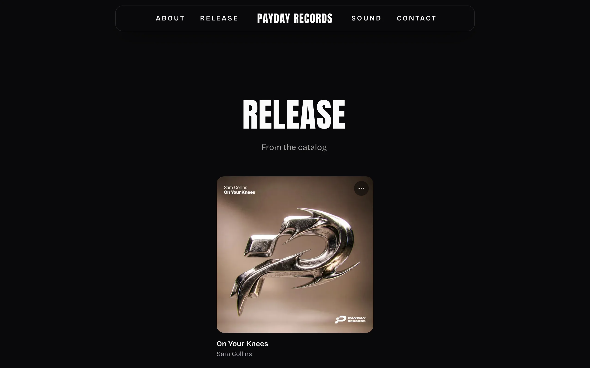
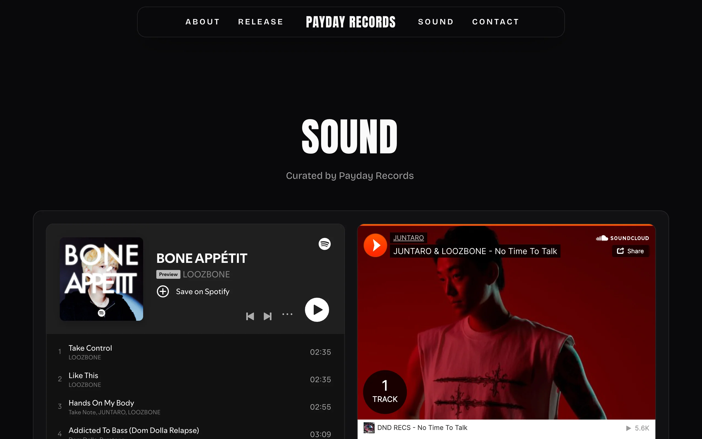
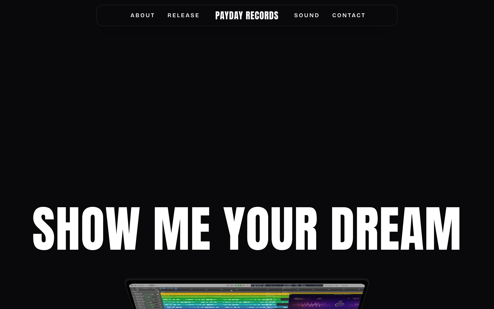

</details>

### [Celebrate Agency ↗](https://celebrate-agency.vercel.app/?utm_source=github&utm_content=repo_readme) · `:3003`

[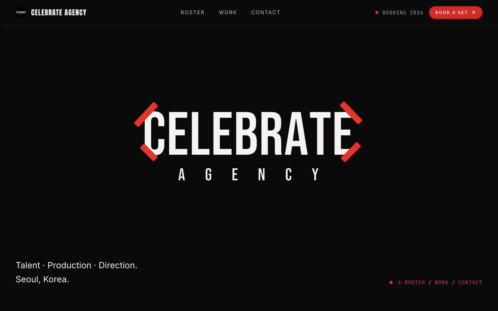](https://celebrate-agency.vercel.app/?utm_source=github&utm_content=repo_readme)

<details>
<summary><strong>Sections</strong> — Roster · Work · Contact</summary>

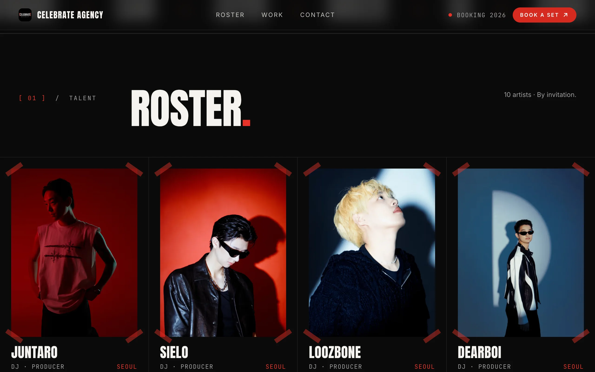
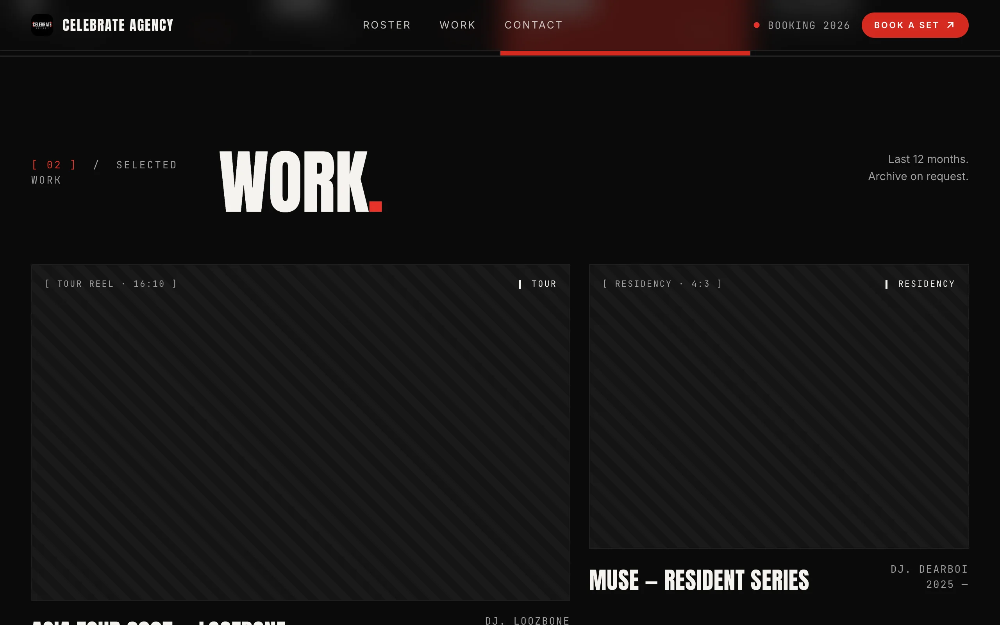
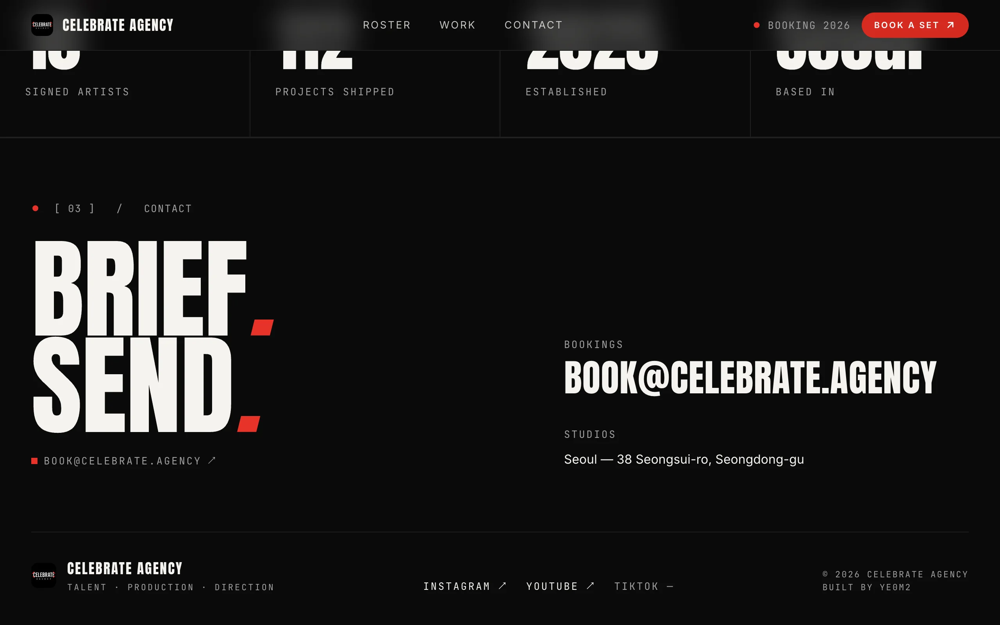

</details>

## Dev

```sh
pnpm install
pnpm dev                                 # all apps (3002 / 3003 / 3004)
pnpm dev --filter=vague-frequency-labs   # one app
pnpm build | pnpm lint | pnpm check-types
```

No test framework — verify with `lint` + `check-types`. See [`CLAUDE.md`](CLAUDE.md) for structure, env, and conventions.
